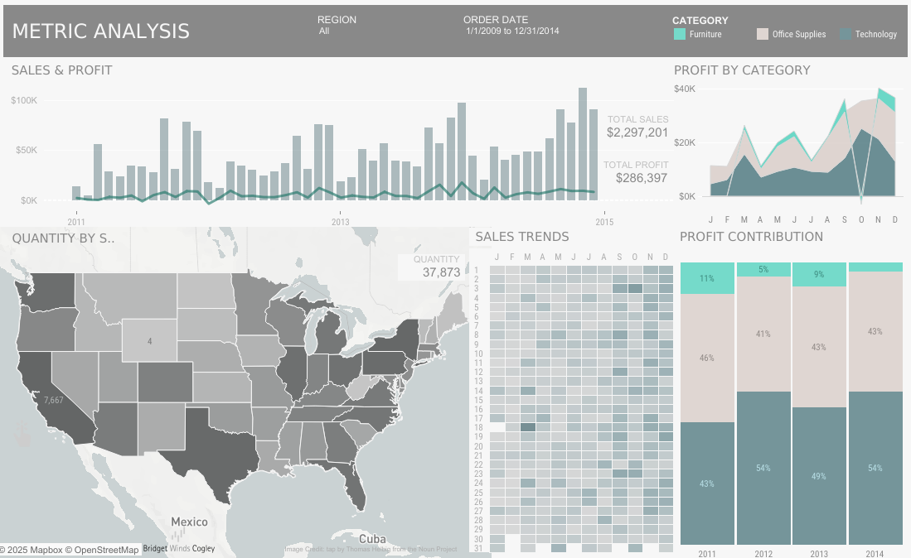
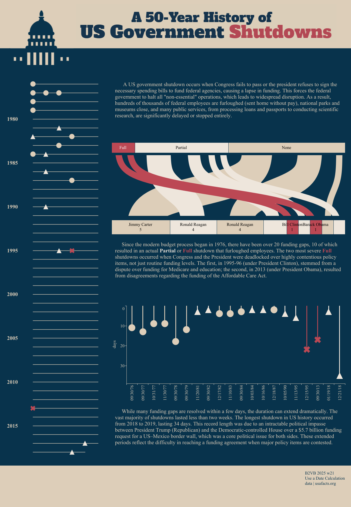

# Data Visualization

## Assignment 2: Good and Bad Data Visualization

### Requirements:

- Data visualizations are important tools for communication and convincing; we need to be able to evaluate the ways that data are presented in visual form to be critical consumers of information
- To test your evaluation skills, locate two public data visualizations online, one good and one bad
    - You can find data visualizations at https://public.tableau.com/app/discover or https://datavizproject.com/, or anywhere else you like!
- For each visualization (good and bad):
    - Explain (with reference to material covered up to date, along with readings and other scholarly sources, as needed) why you classified that visualization the way you did.
      ```
      Your answer...

      (1) Example of a good visualization:
      https://public.tableau.com/app/profile/bridget/viz/MetricAnalysisAlt/MetricsAlt

      This is actually an interactive dashboard containing multiple visualizations
      that depict various metrics from sales data. Overall, I consider this an
      example of a good visualization. Each chart is straightforward,
      self-contained, and serves a clear purpose. The visualizations on this
      dashboard fulfil the three key data visualization qualities of being
      aesthetic, substantive, and perceptible.

      Overall, the layout of the dashboard is well-organized. The choice of
      chart types is purposeful and well-suited to the particular metric being
      depicted. Despite displaying multiple metrics, the visualization avoids
      visual clutter and uses a well-graded color palette. The use of familiar
      chart types ensures that even first-time viewers can quickly understand
      the data.

      ```
      
      ```
      (2) Example of a bad visualization:
      https://public.tableau.com/app/profile/izumi4389/viz/2025w21/1.

      This visualization is titled "A 50-Year History of US Government Shutdowns",
      and at the time of this writing, it appears in the "Trending" section of
      the Tableau Public webpage. It aims to depit a history or timeline, since
      1976, of US goverment "funding gaps", which are significant fiscal events
      that can lead to government shutdowns. Personally, I consider it a bad
      visulization because it is largely ineffective due to several reasons.

      The overall visualization is not aestically appealing. It feels cluttered
      becauset three seperate charts are crowded into a single view, not to
      mention two paragraphs of text reading which is essential to fully
      understand the visuals. The selection of particular chart types seems
      arbitrary, lacking a clear purpose. For example, the use of an alluvial
      diagram is unnecessarily complex is not well-suited to the data being
      presented. The color pallette is weak, with multiple similar tones making
      it difficult to distinguish between them. Overall the aestheic distracts
      rather than support understanding.

      There are also a couple of substantive shortcomings. The main or central
      chart omits key information, such as not labelling "Donald Trump" during
      whose previous term the US experienced a major government shutdown in
      2018. Although this is mentioned in the accompanying text, the ommission
      on the chart creates inconsistency and may mislead viewers, even as other
      presidents are labelled.

      The visualization also lacks in terms of perceptual qualities. It mixes
      multiple types of graphics without clearly indicating which is primary or
      in what order the viewer should read them. The layout is confusing and it
      forces the viewer to navigate between dense visuals and accompanying text
      to make sense of the information. Minor variations in color represent
      distinct concepts ("Partial Shutdown" vs "No Shutdown"), but they are too
      similar to be easily perceived. Consequently, viewers must rely on the
      text rather than the visuals to understand the data. This increases
      cognitive load and diminishes the visualization’s overall effectiveness.
      ```
      

    - How could this data visualization have been improved?
      ```
      Your answer...

      - A multi- or stacked- bar chart could replace the main/central chart and
      depict the same data/information in a cleaner, easier to understand and
      more familiar format.

      - The year-wise chart on the left hand side and the timeline chart at the
      bottom can be comibined into a single chart making it easier for the
      viewer to focus.

      - Use a limited, high-contrast color pallete so that different categories
      (e.g., "partial shutdown" vs "no shutdown") are easily distinguishable.

      - Avoid forcing the viewer to read long paragraphs to understand the
      visualization. Instead, use visual cues like labels, tooltips, and concise
      annotations.
      ```
- Word count should not exceed (as a maximum) 500 words for each visualization (i.e.
300 words for your good example and 500 for your bad example)

### Why am I doing this assignment?:

- This assignment ensures active participation in the course, and assesses the learning outcomes
* Apply general design principles to create accessible and equitable data visualizations
* Use data visualization to tell a story

### Rubric:

| Component               | Scoring   | Requirement                                                 |
|-------------------------|-----------|-------------------------------------------------------------|
| Data viz classification and justification | Complete/Incomplete | - Data viz are clearly classified as good or bad<br />- At least three reasons for each classification are provided<br />- Reasoning is supported by course content or scholarly sources |
| Suggested improvements  | Complete/Incomplete | - At least two suggestions for improvement<br />- Suggestions are supported by course content or scholarly sources |

## Submission Information

🚨 **Please review our [Assignment Submission Guide](https://github.com/UofT-DSI/onboarding/blob/main/onboarding_documents/submissions.md)** 🚨 for detailed instructions on how to format, branch, and submit your work. Following these guidelines is crucial for your submissions to be evaluated correctly.

### Submission Parameters:
* Submission Due Date: `23:59 - 10/26/2025`
* The branch name for your repo should be: `assignment-2`
* What to submit for this assignment:
    * This markdown file (assignment_2.md) should be populated and should be the only change in your pull request.
* What the pull request link should look like for this assignment: `https://github.com/<your_github_username>/visualization/pull/<pr_id>`
    * Open a private window in your browser. Copy and paste the link to your pull request into the address bar. Make sure you can see your pull request properly. This helps the technical facilitator and learning support staff review your submission easily.

Checklist:
- [x] Create a branch called `assignment-2`.
- [x] Ensure that the repository is public.
- [x] Review [the PR description guidelines](https://github.com/UofT-DSI/onboarding/blob/main/onboarding_documents/submissions.md#guidelines-for-pull-request-descriptions) and adhere to them.
- [x] Verify that the link is accessible in a private browser window.

If you encounter any difficulties or have questions, please don't hesitate to reach out to our team via our Slack. Our Technical Facilitators and Learning Support staff are here to help you navigate any challenges.
